# Blog 

## Introduction

[Blog](https://frontend-f-2bf7aea4b103.herokuapp.com) is a blog-platform for sharing ideas, visions and articles.

You can find the backend for this application here: [Blog Backend](https://djrest-f-bfd9b0bcf48e.herokuapp.com)

Users are able to create, update and delete their posts.

The goal is to foster a sharing community where you can either contribute content or simply browse through the creations of others.

## Table of Contents

- [Blog](#blog)
  - [Introduction](#introduction)
  - [Table of Contents](#table-of-contents)
  - [User Personas](#user-personas)
  - [User Stories](#user-stories)
  - [User Goals](#user-goals)
  - [Website Owner Goals](#website-owner-goals)
  - [Design](#design)
    - [Wireframes](#wireframes)
    - [Fonts](#fonts)
    - [Colors](#colors)
  - [Screenshots of Finished Website](#screenshots-of-finished-website)
  - [Features](#features)
  - [Features to Add](#features-to-add)
    - [User Dashboard Features](#user-dashboard-features)
  - [React Components](#react-components)
    - [Reusable Components](#reusable-components)
    - [Pages](#pages)
      - [Auth](#auth)
      - [Articles](#articles)
  - [Framework and Languages](#framework-and-languages)
  - [Libraries](#libraries)
  - [Deployment](#deployment)
    - [Cloning and Forking](#cloning-and-forking)
  - [Testing](#testing)
    - [Validation](#validation)
    - [Lighthouse Reports](#lighthouse-reports)
    - [Responsiveness](#responsiveness)
    - [Manual Testing](#manual-testing)
      - [Navbar](#navbar)
      - [Home Page](#home-page)
      - [Post Detail](#post-detail)
      - [Edit Post](#edit-post)
      - [Contact](#contact)
      - [Sign In](#sign-in)
      - [Register](#register)
    - [User Stories Testing](#user-stories-testing)
      - [Navigation](#navigation)
      - [Authentication](#authentication)
      - [Articles](#articles-1)
  - [Bugs](#bugs)
    - [Bug](#bug)
  - [Bug Fixes](#bug-fixes)
    - [Bug Fix](#bug-fix)
    - [Projects](#projects)
    - [Websites](#websites)
  - [Credits](#credits)

## User Personas

- **Casual User**,
  You enjoy exploring interesting content and discovering new ideas. This is a place to relax, read, and find inspiration at your own pace.

- **Enthusiast** You visit often, eager to explore fresh posts and stay connected to the community. The platform is designed to make browsing simple and enjoyable.

- **The Budding Writer or Creator** You’re here to share your voice and see how your work resonates with others. Posting is straightforward, and you can connect with readers who appreciate your creativity.

## User Stories

My user stories that inspired the development of this website are available in this
[GitHub Project](https://github.com/users/fgit-24/projects/8).

Each issue includes an Title, Acceptance Criteria, and Tasks.

I utilized Agile methodology through labels, and GitHub Projects to organize my work.

For a complete overview, please refer to the Project link. Here’s a brief summary of my user stories:

Title: User Registration  
**Acceptance Criteria:**  
- Users can sign up with a unique email address and password.  
- Validation messages are shown for invalid or missing inputs.  
- A success message is displayed upon successful registration.  

**Tasks:**  
- Create a user registration API endpoint in Django REST Framework (DRF).  
- Implement frontend form validation with React.  
- Design and style the registration form.  

---

Title: User Login  
**Acceptance Criteria:**  
- Registered users can log in with their credentials.  
- Incorrect login attempts display an error message.  
- Successfully logged-in users are redirected to their dashboard.  

**Tasks:**  
- Set up login API endpoint in DRF.  
- Use React state management for handling user authentication status.  
- Add conditional rendering in the navbar to display "Logout" when a user

---

Title: User Logout  
**Acceptance Criteria:**  
- Logged-in users can log out using a logout button.  
- After logout, users are redirected to the home page.  
- The session token is invalidated on the backend.  

**Tasks:**  
- Add a logout API endpoint in DRF.  
- Implement logout functionality in the React frontend.  
- Update navbar to switch to "Login" and "Register" after logout.  

---

Title: Create Article  
**Acceptance Criteria:**  
- Logged-in users can create a new article with a title and body.  
- Form validations are performed to ensure required fields are filled.  
- The article appears in the user's dashboard upon successful creation. 

**Tasks:**  
- Build a "Create Article" API endpoint in DRF.  
- Create a React component for the article creation form.  
- Style the form and display success/error messages.  

---

Title: Update Article  
**Acceptance Criteria:**  
- Users can update their own articles.  
- Changes are saved, and the updated article is displayed.  
- Users cannot update articles they do not own.  

**Tasks:**  
- Set up an "Update Article" API endpoint in DRF.  
- Implement edit functionality in the frontend.  
- Add a button for editing articles on the user dashboard.  

---

## User Goals

1. **Explore Content Easily**  
   Users want to navigate the page effortlessly, discovering engaging and relevant posts without frustration.

2. **Stay Informed and Inspired**  
   Casual browsers and enthusiasts seek fresh, thought-provoking, or entertaining content to spark their interest and provide a rewarding experience.

3. **Share Ideas or Creations**  
   Budding writers or creators aim to publish their work, express themselves, and reach an audience that appreciates their perspective.

4. **Engage with the Community**  
   Users may wish to interact through comments, feedback, or discussions, fostering a sense of connection and belonging.

5. **Return for Updates**  
   Enthusiasts and frequent visitors want a reason to return, whether it's to see new posts, track their contributions, or enjoy a consistent flow of content.

6. **Achieve Simplicity and Convenience**  
   Whether browsing, reading, or sharing, users value a streamlined, user-friendly experience that makes their goals easy to achieve.
 pride in discovering outstanding pieces and organizing them into albums.

## Website Owner Goals

1. **Attract and Retain Users**  
   Create a platform that encourages users to visit frequently and stay engaged with the content.

2. **Encourage Content Sharing**  
   Facilitate easy sharing of posts and contributions to grow the site's visibility and reach a broader audience.

3. **Foster a Community**  
   Build a space where users feel connected, valued, and motivated to contribute and interact with one another.

4. **Showcase High-Quality Content**  
   Ensure the platform highlights valuable, engaging, and well-presented posts to maintain credibility and appeal.

5. **Simplify Site Management**  
   Design the platform for ease of maintenance and updates, ensuring smooth operation with minimal technical challenges.

## Design

1. **Simple and Intuitive Layout**  
   Create a clean, uncluttered design that ensures easy navigation and usability for all types of users.

2. **Responsive and Accessible**  
   Ensure the site works seamlessly across devices and is accessible to users with varying needs, including those with disabilities.

3. **Readable and Engaging Typography**  
   Use fonts that are easy to read and visually appealing, ensuring content is the primary focus.

4. **Consistent Color Scheme**  
   Implement a cohesive color palette that aligns with the website’s tone and purpose, enhancing the overall aesthetic.

5. **Focus on Content**  
   Design the layout to prioritize content, with minimal distractions, ensuring users can quickly find and engage with posts.

### Wireframes

The wireframes below were created using [Figma](https://www.figma.com/).

I referenced these during my development, although some adjustments were made throughout the process.

Home Desktop

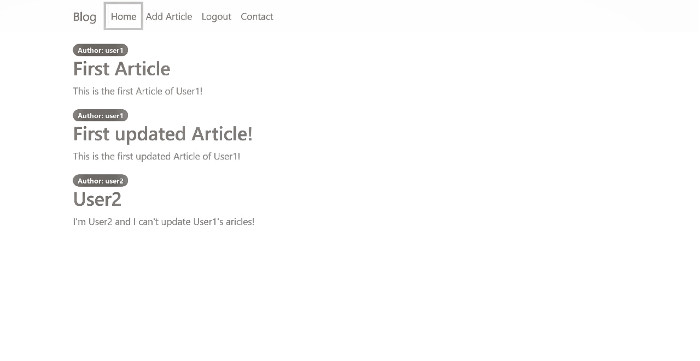

Home Tablet

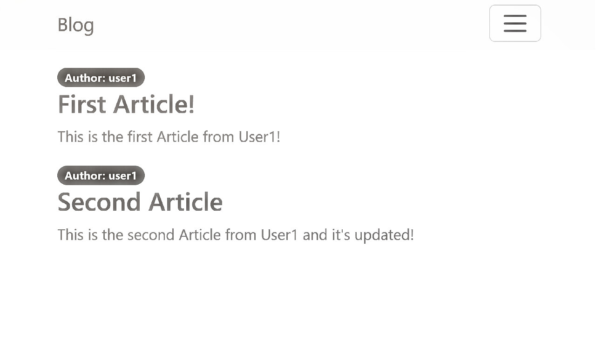

Home Mobile

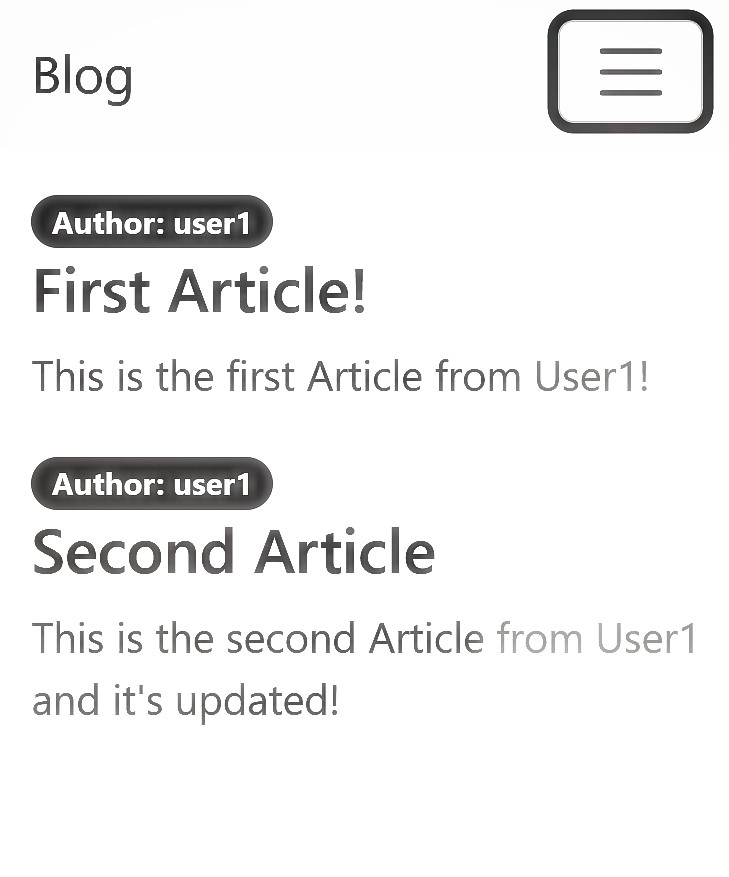

Sign In

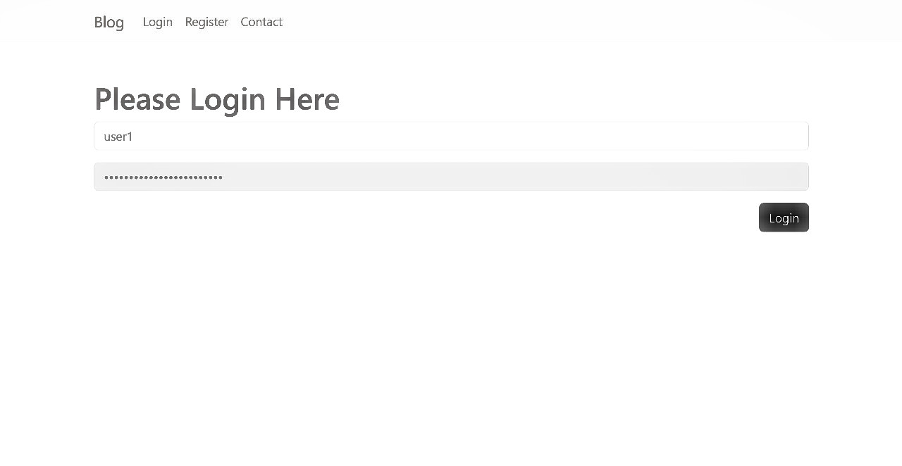

Register

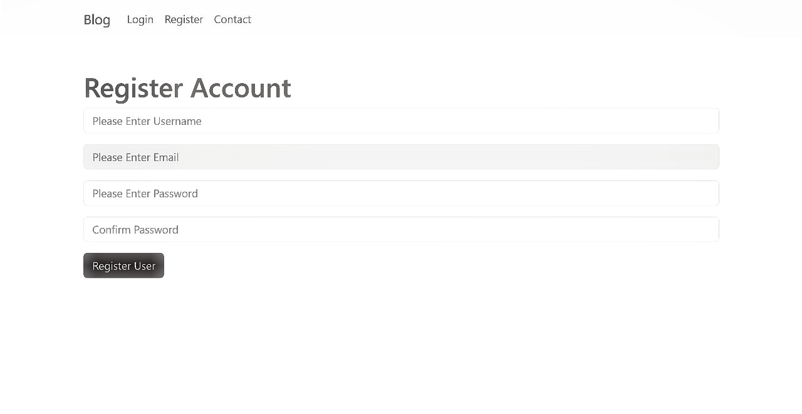

Article Detail

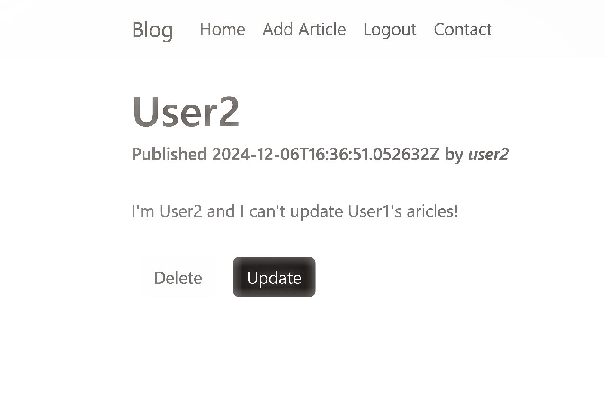

Contact

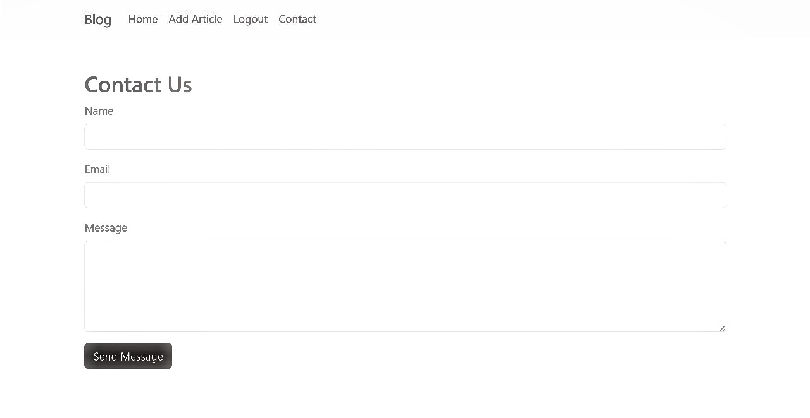

### Fonts

The primary font I used is "Segoe Ui," chosen for its elegant design.

### Colors

## Screenshots of Finished Website

Desktop Homepage.

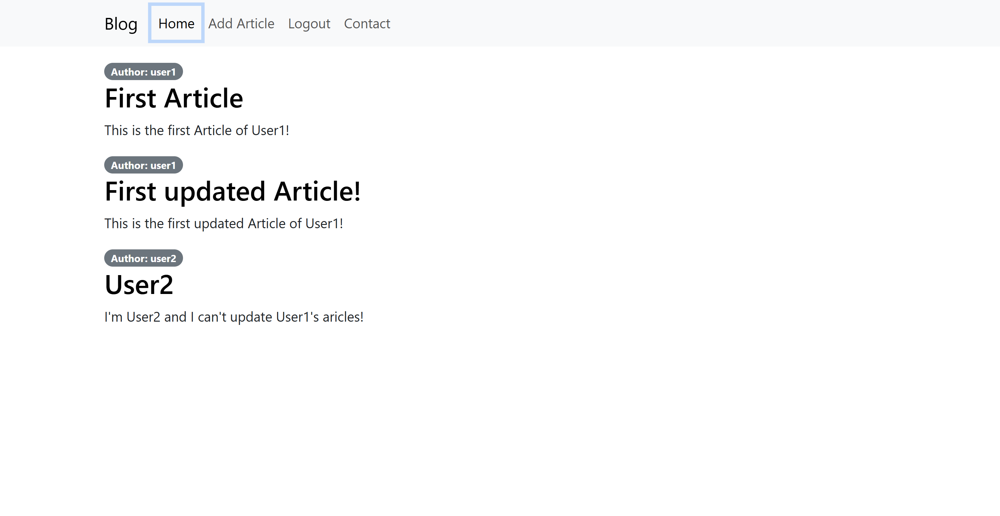

Tablet Homepage.

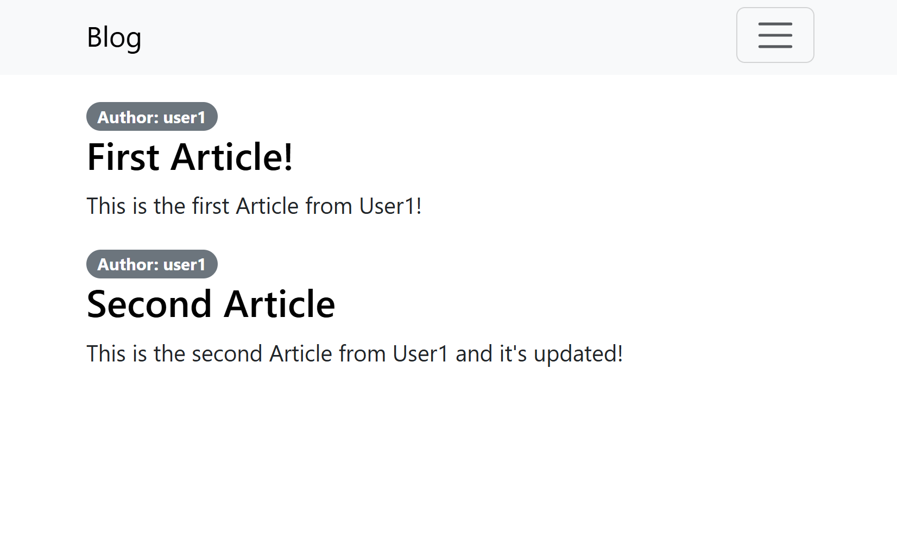

Mobile Homepage.

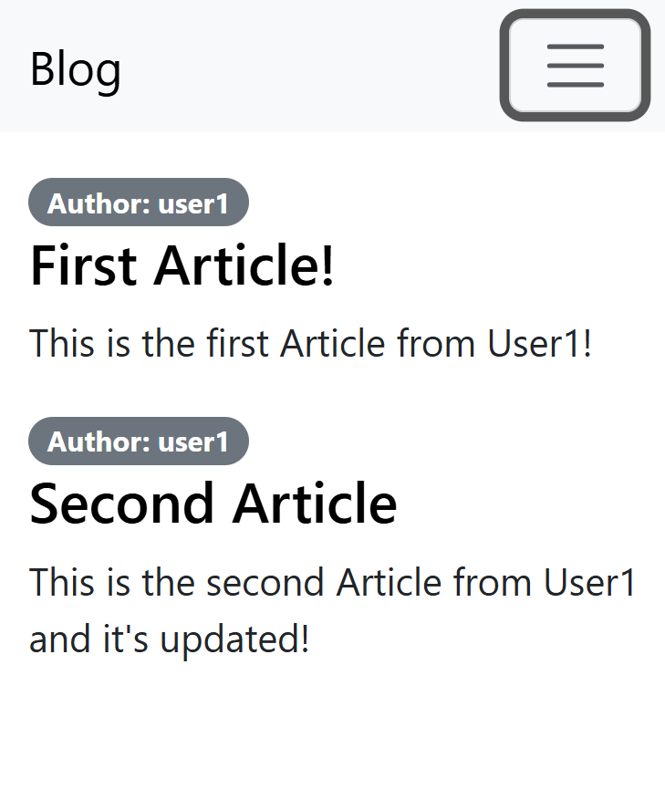

Article Detail Page.

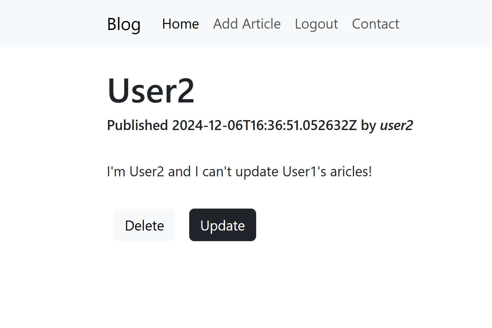

Add Article

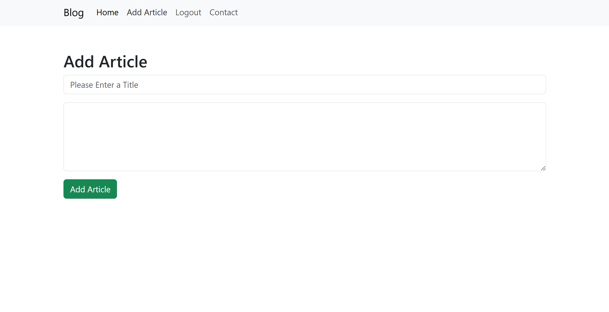

Login

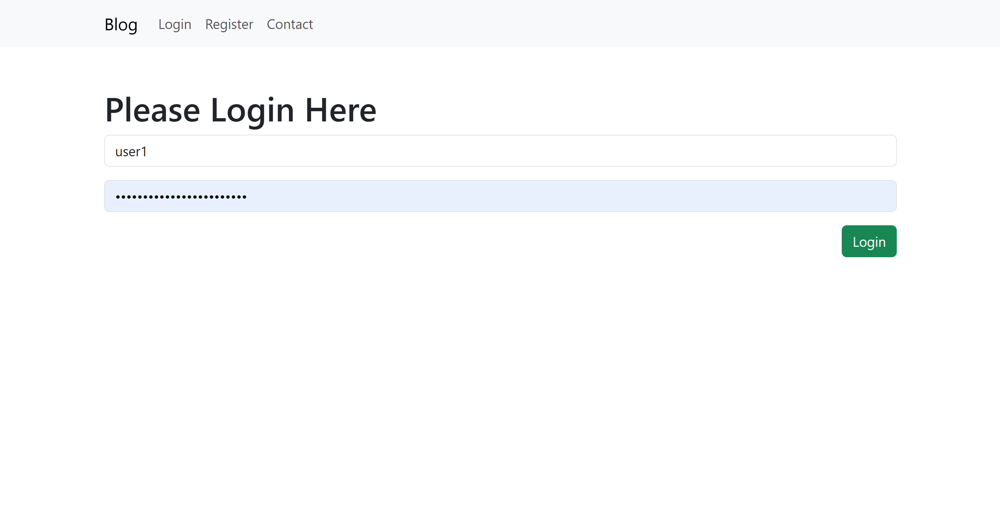

Contact Page

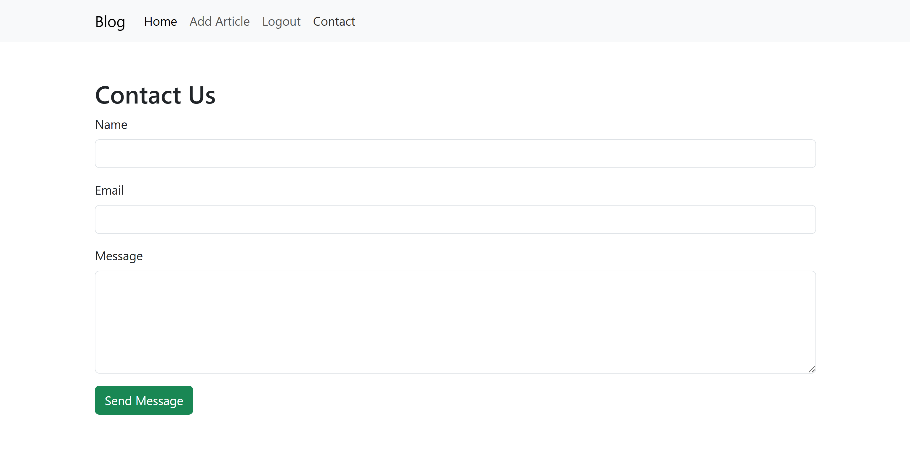

## Features

- Navbar is active, to display where you are on the website.

  This helps make navigation easier.

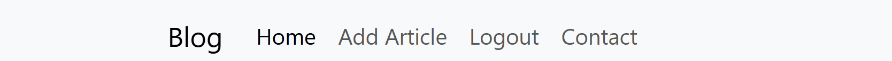

- The responsive navbar expands on larger screens, minimizing clicks and enhancing site navigation.

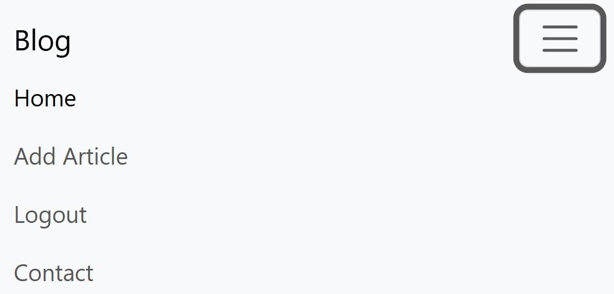

Feedback Message

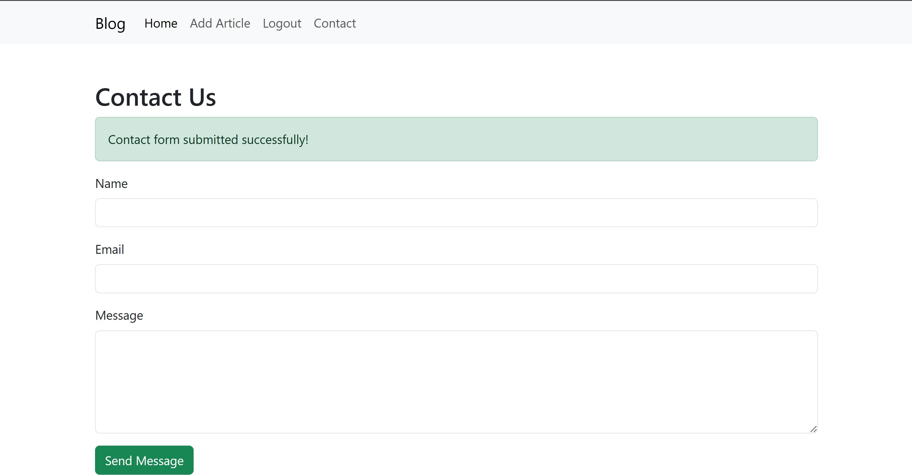

## Features to Add

### User Dashboard Features

Logged-in users will have access to a personalized dashboard where they can manage their articles efficiently. Here’s what the dashboard offers:

1. **View Your Articles**  
   The dashboard displays a complete list of articles created by the user, providing an organized overview of their contributions.

2. **Edit and Delete Options**  
   Users can easily update or remove their articles directly from the dashboard, making it simple to manage their content.

3. **Pagination for Larger Lists**  
   For users with many articles, the dashboard includes pagination to ensure smooth navigation and quick access to all content.

4. **Filter and Sort Articles**  
   Users can filter and sort their articles by criteria such as date, title, or status, helping them find specific entries effortlessly.

## React Components

### Reusable Components

- **NavBar**: The navigation bar used throughout the application.

- **SuccessToastNotification**: A notification utilized throughout the application to indicate successful user actions.

- **ErrorToastNotification**: A notification that informs users of specific errors, indicating that an action they attempted has failed.

- **OwnerDropdown**: A dropdown menu that provides item owners with options for additional actions.

- **useState**: This helps to update the current state.
  

### Pages

#### Auth

- **SignUpForm**: Manages the registration process for new users.

- **SignInForm**: Facilitates the sign-in procedure.

#### Articles

The posts section is divided into five different components.

- **ArticleList**: Utilized wherever a feed of articles is required.

- **Article**: Represents the actual post content.

- **AddArticle**: Handles the creation of new article.

- **UpdateArticle**: A form for modifying existing posts.

- **ArticleDetail**: Displays the post itself, and depending on the logged in user additional functionality like update.

## Framework and Languages

This project was developed using React 18.3.1, with JavaScript and JSX employed for coding.

The README is written in Markdown.

## Libraries

- **React-bootstrap**: Utilized for its comprehensive set of components, styles, and user-friendly interface.

- **React-router-dom**: Used for routing capabilities and additional features such as `searchParams`, `useLocation`, and `useNavigate`. This was particularly beneficial for implementing toast notifications and navigating between pages.

## Deployment

This section outlines the steps I took to deploy this React project.

1. In `package.json`, I added `"heroku-prebuild": "npm install -g serve"` to the scripts section. 

   This is necessary for serving the single-page application on Heroku.

2. I created a `Procfile` in the root directory and included `web: serve -s build`. 

   This informs Heroku that this is a web process and indicates how to serve our single-page application.

3. Visit [Heroku](https://www.heroku.com/) and sign in or register.

4. Create a new app by choosing a unique name, selecting your region, and clicking "create app."

5. Navigate to the "Deploy" tab and connect your GitHub account.

6. Search for the repository you want to deploy and click connect.

7. Click "Deploy branch."

### Cloning and Forking

If you wish to clone or fork this project, you can do so from my [GitHub repository](https://github.com/fgit-24/pp5-frontend/).

Please note that this is only the front-end; you will need a back-end to run the application.

Refer to the [Back-end repository](https://github.com/fgit-24/pp5-djrest) for more details on setting that up.

It’s advisable to start by setting up a virtual environment to avoid conflicts and potential issues.

**Cloning** the project means creating a local copy on your machine, allowing you to make changes without impacting the original repository.

**Forking** means creating a copy of the project in your own GitHub account, which allows you to propose changes to the original project or develop your own modified version.

- Since this project uses npm, it's good practice to do the same.

- Ensure you are in the root directory, then run `npm install`.

## Testing

### Validation

I ran all my pages through the [W3C markup validation service](https://validator.w3.org/#validate_by_uri) with no errors.

My custom CSS was checked using [jigsaw](https://jigsaw.w3.org/css-validator/#validate_by_input) with no errors.

My JavaScript and JSX was validated using [eslint](https://eslint.org/docs/latest/use/getting-started), passing.

### Lighthouse Reports

Below are the Lighthouse reports for my pages:

- **Home:**
  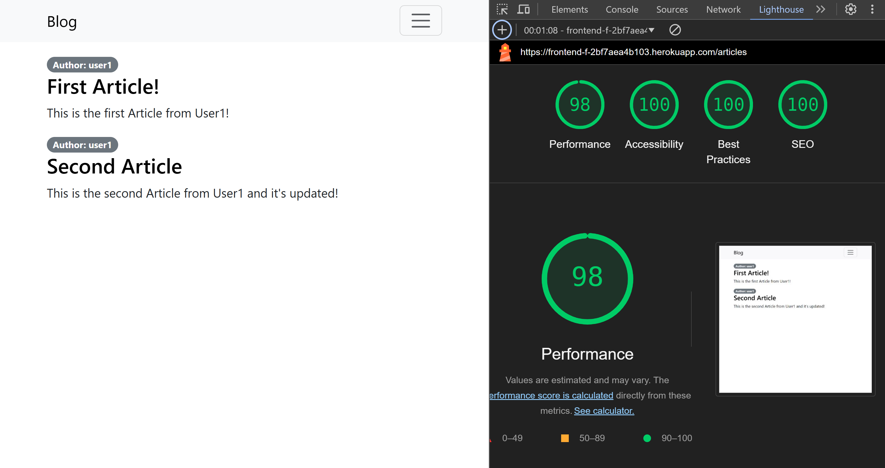

- **Article Detail:**
  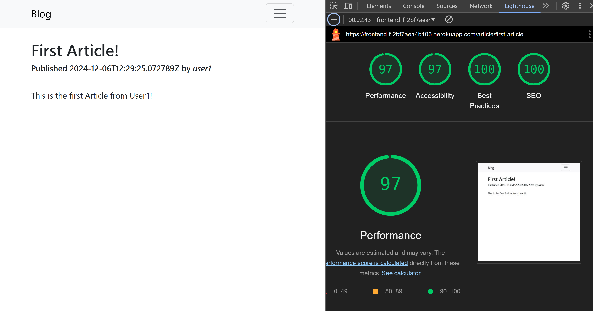

- **Article Add:**
  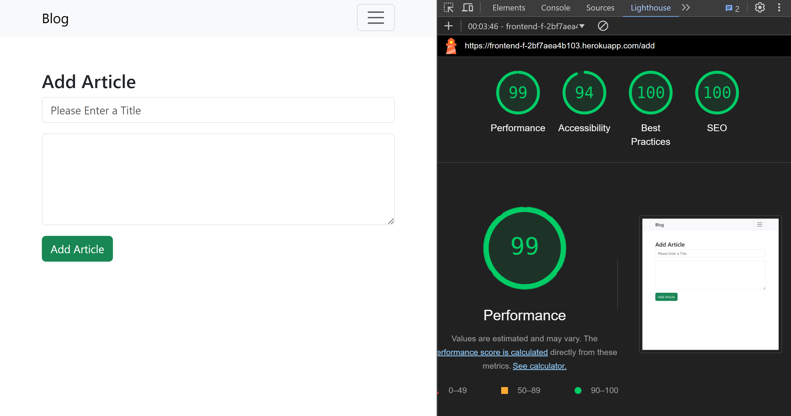

- **Login:**
  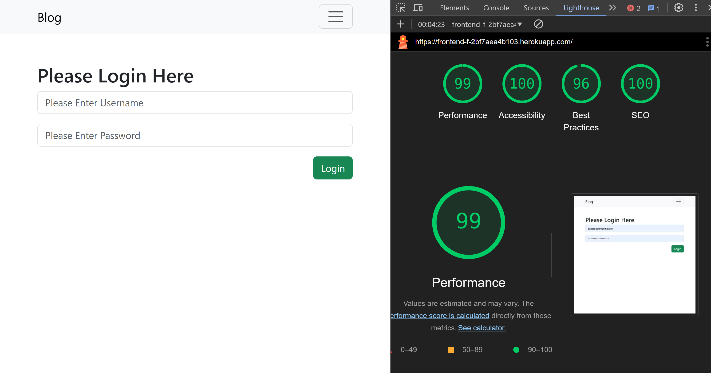

- **Register:**
  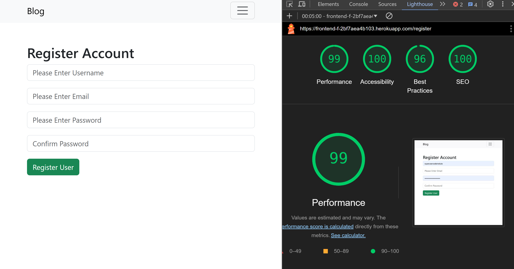

### Responsiveness

The website was thoroughly tested during development to ensure optimal functionality across all screen sizes. 

The primary devices used for testing included:

- Desktop
- iPhone 12 Pro
- Google Pixel 7
- iPad

After deploying to Heroku, I conducted additional tests on:

- Google Pixel 8 Pro
- My personal desktop computer.

Browsers that were tested:

- Google Chrome
- Microsoft Edge
- Brave

### Manual Testing

All titles listed under "Works" were manually tested, with an "X" denoting successful functionality and "no" representing failure.

The final tests documented here were performed on the deployed version on Heroku.

#### Navbar

| Works                                                              |  YES  | NO  |
| ------------------------------------------------------------------ | :---: | --- |
| "Blog " lead to Home page when clicked                             |   X   |     |
| Current page is active                                             |   X   |     |
| Current page is marked in bold text                                |   X   |     |
| Navbar collapses to hamburger on smaller screen                    |   X   |     |
| Hamburger icon expands when clicked                                |   X   |     |
| Links still work when navbar is collapsed                          |   X   |     |
| Conditional statement hides user specific links when not signed in |   X   |     |

#### Home Page

| Works                                                       |  YES  | NO  |
| ----------------------------------------------------------- | :---: | --- |
| Page loads                                                  |   X   |     |
| When I click add Article, I can add an article              |   X   |     |
| When I click a article, it takes me to the post detail view |   X   |     |
| When I click logout, I can add an logout feed               |   X   |     |
| When I click add Home, it takes me to the Article List      |   X   |     |
| When I click add Contact, it takes me to the contact page   |   X   |     |

#### Post Detail

| Works                                     |  YES  | NO  |
| ----------------------------------------- | :---: | --- |
| Page loads                                |   X   |     |
| If I own the articles, I can update it    |   X   |     |
| If I own the articles, I can delete it it |   X   |     |
| I can like the post                       |   X   |     |
| I can only update my own articles         |   X   |     |
| I can only delete my own articles         |   X   |     |

#### Edit Post

| Works                         |  YES  | NO  |
| ----------------------------- | :---: | --- |
| Page loads                    |   X   |     |
| Update Button is displayed    |   X   |     |
| Delete Button is displayed    |   X   |     |
| Update Button updates Artcile |   X   |     |
| Delete Button deletes Article |   X   |     |

#### Contact

| Works                                                        |  YES  | NO  |
| ------------------------------------------------------------ | :---: | --- |
| Page loads                                                   |   X   |     |
| All users can access the page even if they are not logged in |   X   |     |
| Submit Button is functioning                                 |   X   |     |
| After submitting the user gets a feedback                    |   X   |     |

#### Sign In

| Works                                                       |  YES  | NO  |
| ----------------------------------------------------------- | :---: | --- |
| Page loads                                                  |   X   |     |
| The link to the register page takes me to the sign register |   X   |     |
| The form will not allow any blank fields                    |   X   |     |
| On successful sign in I am taken to the home page           |   X   |     |
| On successful sign in I can see my username in the navbar   |   X   |     |

#### Register

| Works                                                     |  YES  | NO  |
| --------------------------------------------------------- | :---: | --- |
| Page loads                                                |   X   |     |
| The link to the sign in page takes me to the sign in page |   X   |     |
| The form will not allow any blank fields                  |   X   |     |
| The passwords must match                                  |   X   |     |
| On successful sign up I am taken to the sign in page      |   X   |     |

### User Stories Testing

Here I have viewed the user stories in my GitHub project, and carefully gone through my acceptance criteria for each user story.

If the criteria is met, it is marked in these tables below.

Finally the issue for each user story in my project has been closed if the acceptance criteria was met.

#### Navigation

- As a Site User I can access a navbar from every page so that I can navigate the site easily.

| Acceptance criteria met           |  YES  | NO  |
| --------------------------------- | :---: | --- |
| Nav bar is present on all pages   |   X   |     |
| Navbar can be used for navigation |   X   |     |

#### Authentication

- As a Site User I can register an account so that I can access more features.

| Acceptance criteria met                       |  YES  | NO  |
| --------------------------------------------- | :---: | --- |
| I can access the page to register an account. |   X   |     |
| There is a form that I can use to sign up.    |   X   |     |
| The form creates an account when submitted.   |   X   |     |

- As a Site User I can sign in so that I get access to additional features.

| Acceptance criteria met            |  YES  | NO  |
| ---------------------------------- | :---: | --- |
| Sign in page is accessible         |   X   |     |
| Sign in page has a form to sign in |   X   |     |
| A registered user can sign in      |   X   |     |

- As a Site User I can see my logged in status so that I can log out if I need to.

| Acceptance criteria met                                        |  YES  | NO  |
| -------------------------------------------------------------- | :---: | --- |
| When I am logged in it is reflected with my name in the navbar |   X   |     |
| I get access to additional links                               |   X   |     |

- As a Site User I can remain logged in for some Blog , or until I log out so that I have a good experience.

| Acceptance criteria met                             |  YES  | NO  |
| --------------------------------------------------- | :---: | --- |
| After signing in, I stay signed in until I sign out |   X   |     |

#### Articles

- As a Site User I can add articles so that I can share my content.

| Acceptance criteria met                          |  YES  | NO  |
| ------------------------------------------------ | :---: | --- |
| I can access Add Articles when logged in         |   X   |     |
| Add Articles has a form to create a article      |   X   |     |
| When the form is submitted my article is created |   X   |     |

- As a Site User I can view a single article so that I can interact with it.

| Acceptance criteria met                          |  YES  | NO  |
| ------------------------------------------------ | :---: | --- |
| When visiting the URL of a article I can view it |   X   |     |

- As a Site User I can view a feed of articles so that I can get the latest content.

| Acceptance criteria met                            |  YES  | NO  |
| -------------------------------------------------- | :---: | --- |
| When on the homepage a feed of articles are loaded |   X   |     |

- As a Site User I can delete my articles so that I can remove it if I want to.

| Acceptance criteria met                        |  YES  | NO  |
| ---------------------------------------------- | :---: | --- |
| A signed in user can delete their own articles |   X   |     |

- As a Site User I can update my articles so that I can change it if I want to.

| Acceptance criteria met                                                              |  YES  | NO  |
| ------------------------------------------------------------------------------------ | :---: | --- |
| When viewing a post as the owner, I can choose to edit the article                   |   X   |     |
| When clicking edit post, I get taken to a form that is pre-filled with the post data |   X   |     |
| When submitting the updated data, my post is updated                                 |   X   |     |

## Bugs

### Bug

I couldn't fetch my url data!

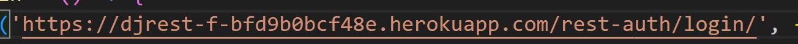

## Bug Fixes

It took me a while to figure out, that I had to adjust my address, because rest-auth got updated and now it's not 'rest-auth' anymore, but 'dj-rest-auth'.

### Bug Fix

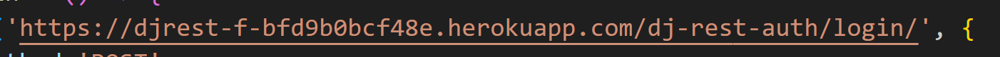

### Projects

I took a course by [Udemy Course](https://www.udemy.com/course/django-django-rest-framework-build-rest-api-in-python/learn/lecture/29085468#overview). But my project has major changes and additions, like for example the contact page.

### Websites

[Am I responsive](https://ui.dev/amiresponsive) was utilized for generating the images of my website, which are placed at the top of this README.

## Credits

I want to thank Code Institute, it's been an amazing journey, and I've learned a lot!
